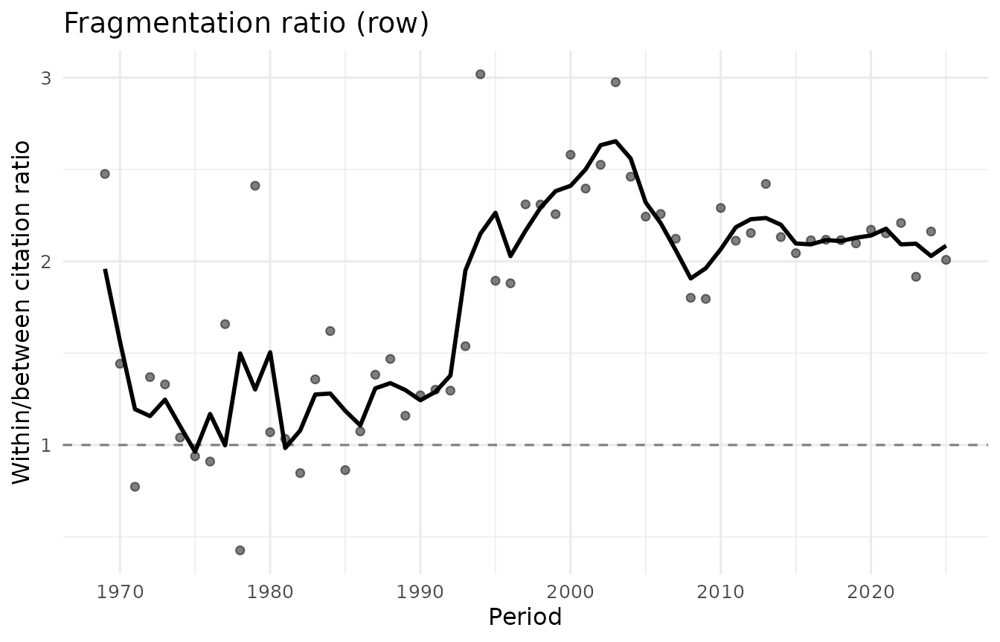
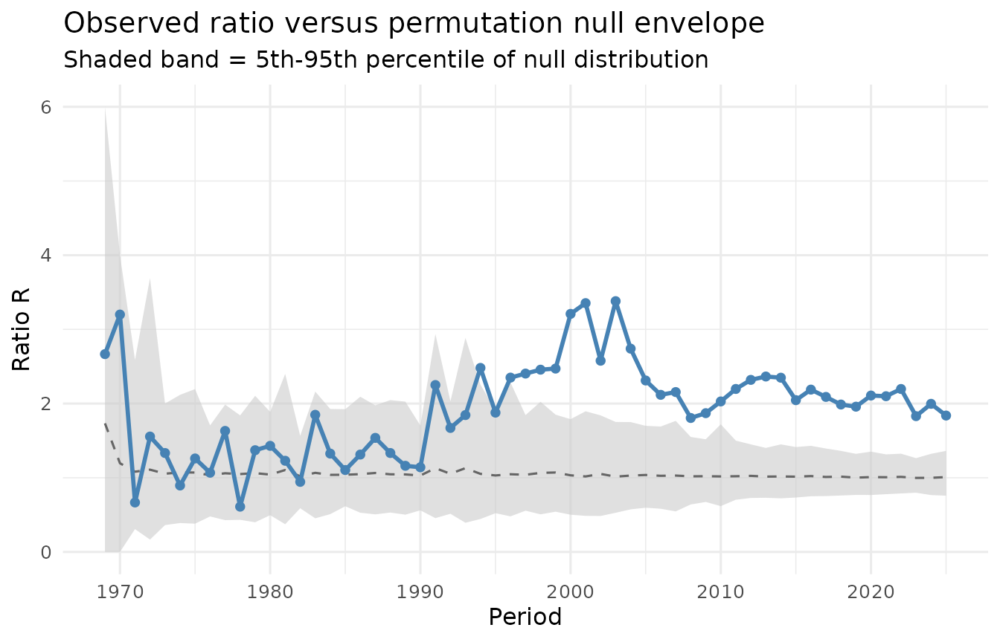
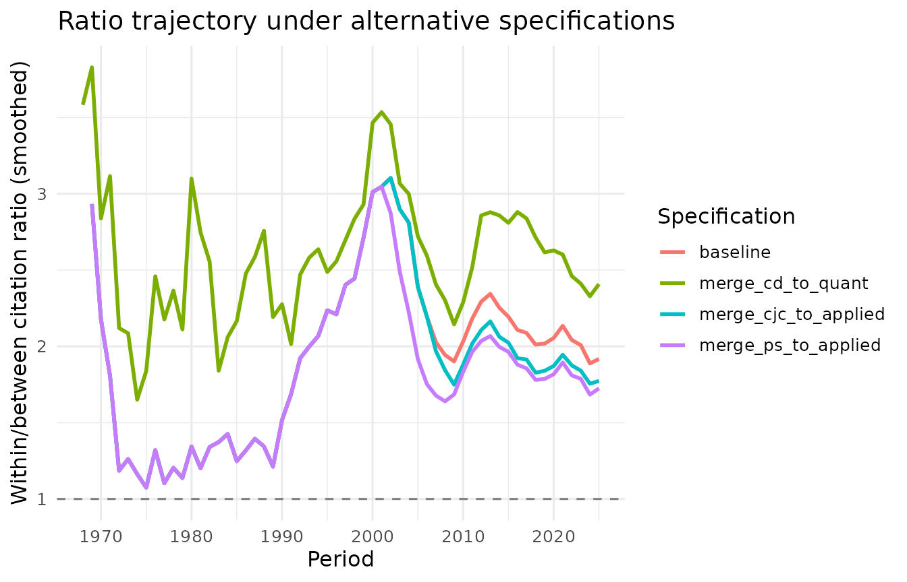
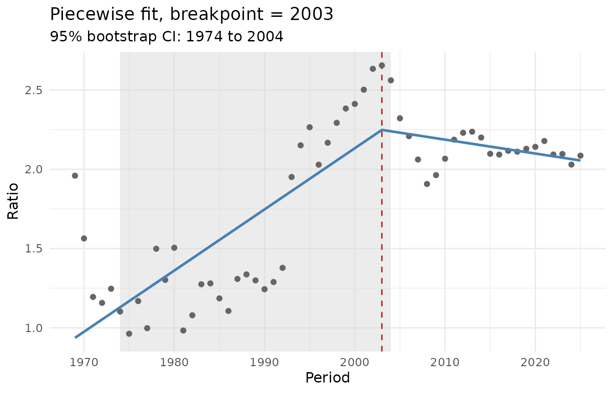
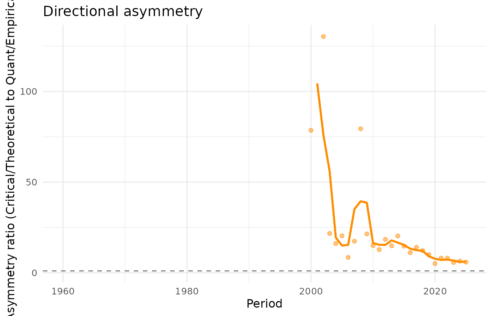

# Introduction to citefrag

## Overview

The `citefrag` package measures within-group versus between-group
citation preference in longitudinal citation networks. This vignette
walks through the full analytical pipeline using the bundled 23-journal
criminology panel as an example. The same workflow applies to any
citation panel with prior group assignments.

## Setup

``` r
library(citefrag)
data(criminology_panel)

criminology_panel
#> <citation_panel>
#>   Periods: 66  (1960 to 2025)
#>   Nodes:   23
#>   Groups:  4  (Quant/Empirical, Applied/Practice, Intl/Comparative, Critical/Theoretical)
#>   Sizes:   time-varying
```

The panel contains 66 annual citation matrices for 23 journals, grouped
into 4 traditions.

## Stage 1: The fragmentation ratio

The central measurement of the package is the pair-averaged
within-between citation ratio. For each year, it compares the mean
number of citations between journals within the same tradition to the
mean number between journals in different traditions.

``` r
fr <- fragmentation_ratio(criminology_panel, normalise = "row")
print(fr)
#> <fragmentation_ratio>
#>   Periods: 57  (1969 to 2025)
#>   Normalisation: row
#>   Smoothing:     3-period centred moving average
#>   Peak:   R = 3.02  in 1994
#>   Final:  R = 2.01  in 2025
plot(fr)
```



The `normalise` argument controls how size differences between journals
are handled. The four options are `"raw"`, `"row"`, `"target"`, and
`"article_pair"`; each answers a slightly different question.
Row-normalisation gives each journal equal weight regardless of its
publication volume.

## Stage 2: Significance testing

A permutation test evaluates whether the observed ratio is larger than
what would be expected under random assignment of journals to
traditions, holding the matrix and group sizes fixed.

``` r
pt <- fragmentation_test(criminology_panel, n_perm = 1000L, seed = 42L)
print(pt)
#> <fragmentation_test>
#>   Normalisation: raw
#>   Periods tested: 57
#>   2025: observed R = 1.84, null mean = 1.01, z = 4.02, p = 0.0060
plot(pt)
```



The test is exact when the number of distinct permutations is feasible
to enumerate, and Monte Carlo otherwise.

## Stage 3: Robustness checks

Two kinds of robustness check are built in. The first reruns the
analysis under alternative group specifications, testing whether the
trajectory depends on where the group boundaries are drawn. The second
restricts the panel to a fixed subset of nodes, testing whether the
trajectory is driven by the entry of new nodes.

``` r
data(criminology_alternatives)
rb <- fragmentation_robustness(
  criminology_panel,
  alternatives = criminology_alternatives
)
print(rb)
#> <fragmentation_robustness>
#>   Normalisation: raw
#>   Specifications: 4 (including baseline)
#> 
#>   Correlations with baseline:
#>     merge_cd_to_quant          r = 0.652 (raw), 0.754 (smoothed)
#>     merge_ps_to_applied        r = 0.967 (raw), 0.963 (smoothed)
#>     merge_cjc_to_applied       r = 0.992 (raw), 0.990 (smoothed)
plot(rb)
```



## Stage 4: Structural break detection

A piecewise linear regression with a grid-searched breakpoint and
bootstrap confidence interval identifies where (if anywhere) the
trajectory changes character.

``` r
cp <- fragmentation_changepoint(fr, seed = 42L, n_boot = 500L)
print(cp)
#> <fragmentation_changepoint>
#>   Breakpoint:   2003  (95% bootstrap CI: 1974 to 2004)
#>   Slope before: +0.0386 per period  (p = < 0.0001)
#>   Slope after:  -0.0088 per period  (p = 0.2196)
#>   R-squared:    0.671
plot(cp)
```



## Directional asymmetry

The fragmentation ratio is symmetric by construction: it does not reveal
which group cites which. The
[`asymmetry()`](https://zarina-vakhitova.github.io/citefrag/reference/asymmetry.md)
function addresses this, measuring how unevenly citations flow between
two specified groups over time.

``` r
asy <- asymmetry(
  criminology_panel,
  from_group = "Critical/Theoretical",
  to_group   = "Quant/Empirical"
)
print(asy)
#> <fragmentation_asymmetry>
#>   From group: Critical/Theoretical
#>   To group:   Quant/Empirical
#>   Periods:    66
#>   2025: ratio = 5.84 (share 0.233 vs 0.040)
plot(asy)
#> Warning: Removed 41 rows containing missing values or values outside the scale range
#> (`geom_line()`).
#> Warning: Removed 41 rows containing missing values or values outside the scale range
#> (`geom_point()`).
```



## References

Vakhitova, Z. (2026). The fragmentation of criminology: a longitudinal
citation network analysis. *Manuscript in preparation.*
